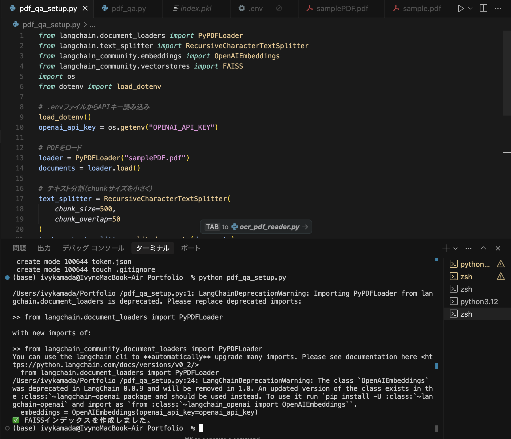

# 📄 PDF質問応答AIシステム

これは、LangChain + OpenAI + FAISS を活用して、任意の PDF に関する質問に自然言語で答えてくれる AI アシスタントです。

## ✅ 機能概要

- 任意の PDF ファイルを読み込み
- テキストを分割し、ベクトル化して FAISS インデックスを作成
- GPT-3.5/4 を使って関連情報をもとに質問に回答

## 🧠 使用技術

- Python 3.x
- LangChain
- OpenAI GPT API
- FAISS（類似文書検索）
- PyPDF2（PDFテキスト抽出）
- dotenv（APIキー管理）

## 🛠 セットアップ手順

1. `.env` ファイルを作成し、以下を記述：

OPENAI_API_KEY=sk-xxxxxxxxxxxxxxxxxxxxxxxxxxxx

markdown

2. 必要なライブラリをインストール：

pip install -r requirements.txt

markdown

3. インデックスを作成：

python pdf_qa_setup.py

markdown
コピーする
編集する

4. 質問応答を実行：

python pdf_qa.py

yaml

---

## 📸 操作画面サンプル

### インデックス作成の様子

### 質問応答の様子

---

## 🙋‍♀️ 開発者  
Riho Kamada（[@riho_dev](https://github.com/RihoKamada)）

## 📝 ライセンス  
MIT License

